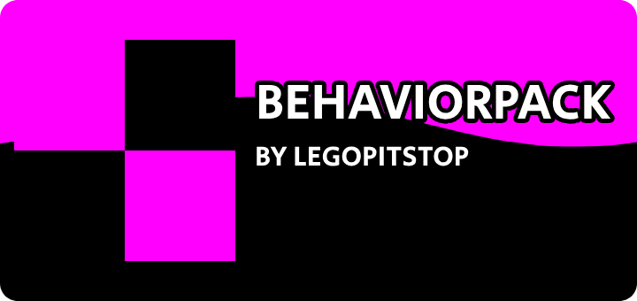

# BehaviorPack

Template bedrock behavior pack

## Addon Data

| Key                | Value     |
| ------------------ | --------- |
| supported          | `yes`     |
| namespace          | `mod_id`  |
| version            | `1.0.0`   |
| UUID               | `UUID3`   |
| mc_version         | `1.21.51` |
| multiplayer_tested | `no`      |
| has_config         | `no`      |
| dependency         | `null`    |

## LINKS

- [Download](https://lpsmods.dev)
- [Wiki Page](https://github.com/legopitstop/BehaviorPack/wiki)
- [License](https://license.lpsmods.dev)
- [Bug Report](https://github.com/legopitstop/BehaviorPack/issues)
